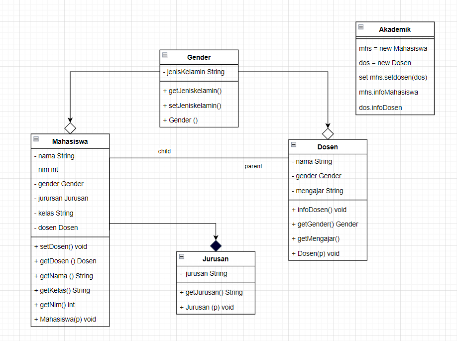
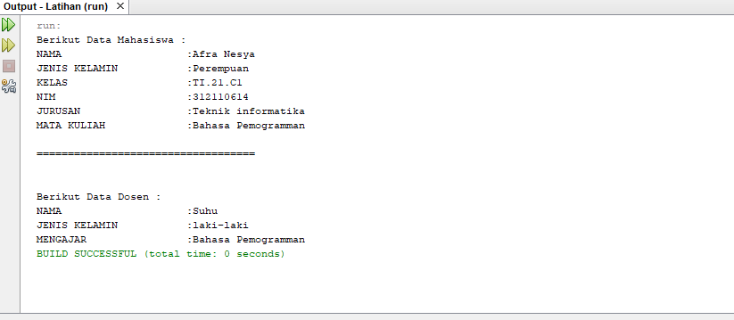

# Praktikum7
Latihan-Tugas

# Latihan-Tugas

<p><b> Nama    :   Afra Nesya Apriyanthi </p>
<p><b> NIM     :   312110614 </p>
<p><b> Kelas   :   TI.21.C1 </p>
<p><b> Mata Kuliah : Pemrograman Orientasi Objek</p>
<p><b> Tugas Pertemuan 9 </p>


<p> Berikut soal dari latihan  <p>



berikut script javanya
Mahasiswa.java

```java
public class Mahasiswa {
    // Atribute
    private String nama;
    private int nim;
    private Gender gender;
    private Jurusan jurusan;
    private String kelas;
    private Dosen dosen;


    public void infoMahasiswa(){
        System.out.println("Berikut Data Mahasiswa :");
        System.out.println("NAMA \t\t\t:"+getNama());
        System.out.println("JENIS KELAMIN \t:"+gender.getJenisKelamin());
        System.out.println("KELAS \t\t\t:"+getKelas());
        System.out.println("NIM \t\t\t:"+getNim());
        System.out.println("JURUSAN \t\t:"+jurusan.getJurusan());
        // Asosiasi/use a dari class Dosen
        System.out.println("MATA KULIAH \t:"+getDosen().getMengajar());
        System.out.println("\n===================================\n");

    }

    public void setDosen(Dosen dosen) {
        this.dosen = dosen;
    }

    public Dosen getDosen() {
        return dosen;
    }

    public String getNama() {
        return nama;
    }

    public String getKelas() {
        return kelas;
    }
    public int getNim() {
        return nim;
    }

    // Constructor class Mahasiswa
    public Mahasiswa(String nama, String kelas, int nim, Gender gender){
        this.nama = nama;
        this.kelas =kelas;
        this.nim = nim;
        this.gender = gender;
        jurusan= new Jurusan("Teknik informatika");
    }

}
```

selanjutnya membuat java baru dengan nama Dosen.java

```java
public class Dosen {
    private String nama;
    private Gender gender;
    private String mengajar;

    public void infoDosen(){
        System.out.println("\nBerikut Data Dosen :");
        System.out.println("NAMA \t\t\t:" +nama);
        System.out.println("JENIS KELAMIN\t:"+getGender().getJenisKelamin());
        System.out.println("MENGAJAR \t\t:" +getMengajar());


    }
    //Method SETTER GETTER
    public Gender getGender() {
        return gender;
    }
    public String getMengajar() {
        return mengajar;
    }

    //Constructor class Dosen
    public Dosen(String nama, String mengajar,Gender jenis){
        this.nama = nama;
        this.mengajar = mengajar;
        this.gender =jenis;
    }
}
```

selanjutnya membuat java baru dengan nama Gender.java

```java
public class Gender {
    // Atribute
    private String jenisKelamin;

    //method SETTER GETTER
    public String getJenisKelamin() {
        return jenisKelamin;
    }
    // Constructor class Gender
    public Gender(String jenisKelamin){
        this.jenisKelamin = jenisKelamin;
    }
}
```

selanjutnya membuat java baru dengan nama Jurusan.java

```java
public class Jurusan {
    // Atribute
    private String jurusan;

    // Method SETTER GETTER
    public String getJurusan() {
        return jurusan;
    }

    public Jurusan(String jurusan){
        this.jurusan = jurusan;
    }

}
```

dan terakhir membuat java baru dengan nama Akademik.java
```java
public class Akademik {
    // Call Methode
    public static void main(String[] args) {
        //Menampilkan hasil Agregasi class Mahasiswa pada class Gender
        Mahasiswa mhs =new Mahasiswa("Afra Nesya","TI.21.C1",312110614,new Gender("Perempuan"));
        //Menampilkan hasil Agregasi class Dosen pada class Gender
        Dosen dos = new Dosen("Suhu","Bahasa Pemogramman",new Gender("laki-laki"));
        // menampilkan Mata Kuliah dengan setter hasil Asosiasi Mahasiswa use a Dosen
        mhs.setDosen(dos);
        //Menampilkan Method
        mhs.infoMahasiswa();
        dos.infoDosen();
    }
}
```

<p> Maka hasil outputnya adalah<p>



